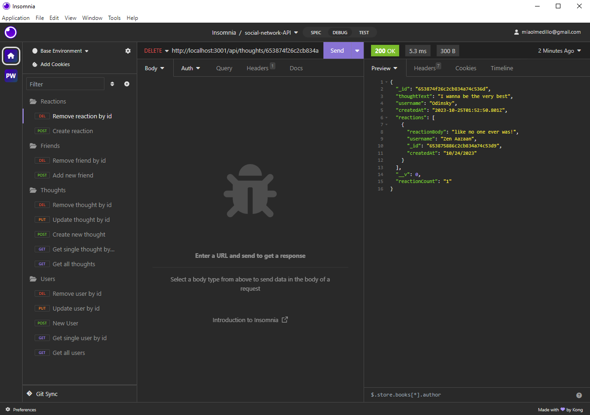

# Social Network API

## Description
API for a social network web application where users can share their thoughts, react to friends' thoughts, and create a friend list. 

## Table of Contents 

- [Installation](#installation)
- [Usage](#usage)
- [Credits](#credits)
- [License](#license)

## Installation

You can access this project by clicking the following link: https://github.com/TheRealMi/socialAPI

## Usage
1. Clone repo to your computer
2. Open the code in a new integrated terminal
3. Run the application in the terminal by typing ""
4. Open insomnia to test the desired routes

Watch the video below to see a walkthrough of the application:
<a href="https://watch.screencastify.com/v/reXJWTB8AtNcWGSrNLBP">()</a>

## Credits

[Coding Bootcamp](https://courses.bootcampspot.com)

[Professor Phil Loy](https://github.com/philliploy)

## License

This project is licensed under the [MIT License](LICENSE).

